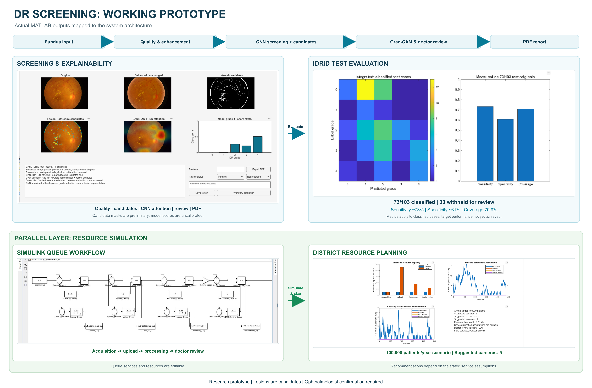
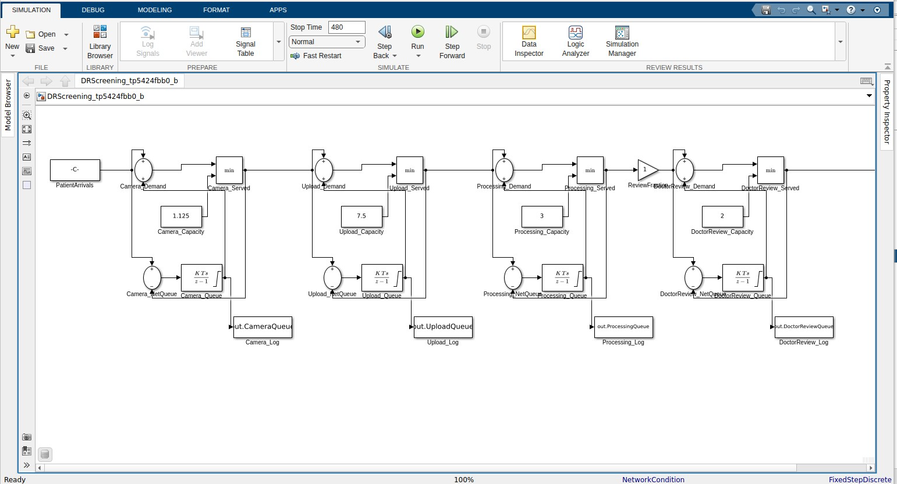

# Explainable Diabetic Retinopathy Screening in MATLAB

A research prototype for rural retinal screening that combines fundus-image
quality control, adaptive enhancement, candidate retinal evidence, five-class
diabetic retinopathy grading, Grad-CAM, clinician review, PDF reporting, and a
Simulink resource-capacity model.

> This is a student research prototype. It is not a medical device and must
> not be used to diagnose patients or recommend treatment.



## What the prototype demonstrates

1. Fundus-image input with automatic field detection.
2. Focus, exposure, illumination and framing quality checks.
3. Conditional enhancement for borderline images and recapture feedback.
4. Transparent vessel and lesion-candidate image-processing baselines.
5. Five-class DR grading using an external trained MATLAB CNN.
6. Genuine Grad-CAM attention for the displayed CNN grade.
7. Clinician review fields and a two-page PDF screening report.
8. IDRiD evaluation with referral metrics and a five-class confusion matrix.
9. MATLAB and Simulink screening-capacity simulation.


## Repository status

The complete MATLAB source code, engineering checks, documentation and
presentation assets are included. The clinical datasets are not redistributed.
The trained model must be copied into `models/trainedDRModel.mat`; see
[`models/README.md`](models/README.md).

The team's demonstrated model is a `DAGNetwork` trained on 600 APTOS 2019
images. It accepts 224 x 224 RGB input and outputs classes 0–4. Its exact
training script, backbone and full held-out APTOS evaluation were not available,
so this repository does not invent those details.

## Requirements

- MATLAB R2026a was used for the demonstrated run.
- Image Processing Toolbox
- Computer Vision Toolbox
- Deep Learning Toolbox
- Statistics and Machine Learning Toolbox
- Simulink for the workflow model
- Medical Imaging Toolbox is compatible but not required by current functions.

## Quick start

1. Clone or download this repository.
2. Copy the trained network to `models/trainedDRModel.mat`.
3. Optionally extract IDRiD to `datasets/IDRiD/`.
4. Open the repository folder in MATLAB or MATLAB Online.
5. Run:

```matlab
startHere
```

In the application, choose a fundus image and click **Run screening**. If
IDRiD is not installed, `demo_assets/synthetic_fundus.png` can exercise the
interface and report workflow, but it has no clinical meaning.

Create an Open in MATLAB Online link after naming the GitHub repository:

```text
https://matlab.mathworks.com/open/github/v1?repo=GITHUB_USERNAME/REPOSITORY_NAME&file=startHere.m
```

## Engineering checks

Run the checks before presenting or releasing a revision:

```matlab
cd(fileparts(which('startHere')))
addpath(genpath(pwd))
addpath(fullfile(pwd,'core','matlab_stage123'),'-begin')
checkFullDRDemo
```

The checks cover output geometry and ranges, quality withholding, PDF and JSON
creation, metric arithmetic, reproducible queue simulation and workload
conservation. They do not establish clinical accuracy.

## Uploading through the GitHub website

GitHub limits normal browser uploads to 25 MiB per file. All source and
documentation files in this package fit that limit, but the approximately
95 MB trained model does not.

1. Extract `explainable-dr-screening-matlab.zip` on your computer.
2. Create an empty GitHub repository.
3. Select **Add file → Upload files**.
4. Drag the **contents inside** the extracted folder onto the page. Do not
   upload only the ZIP because GitHub will not extract it into source files.
5. Commit the files to `main`.
6. Open **Releases → Draft a new release**.
7. Compress the model as `trainedDRModel.zip`, create tag `v1.0.0`, attach
   that ZIP file, and publish the release.

Anyone running the project downloads that release asset, extracts it, and
places `trainedDRModel.mat` at `models/trainedDRModel.mat` after cloning or
downloading the source repository.

## Data and model setup

IDRiD is discovered recursively, including its original nested directory
layout. Dataset installation details are in [`datasets/README.md`](datasets/README.md).

For a website-only workflow, publish the trained model as a GitHub Release
asset. The included `.gitattributes` also supports Git LFS if the repository
is later maintained through Git or GitHub Desktop. Do not upload APTOS or
IDRiD image folders to the repository.

## How prediction works

The quality gate runs before inference. Images marked `rejected` or
`review_required` do not receive an automatic grade. Eligible original images
are resized to 224 x 224 RGB and passed to the CNN using the `zero_255` adapter;
the network then applies its stored `zerocenter` normalization. Enhancement is
displayed for comparison but is not silently substituted for the CNN input.

The highest of the five scores determines the displayed grade. The referable
score is the sum of scores for grades 2, 3 and 4. The default 0.50 referral
threshold is provisional. Grad-CAM shows class attribution, not lesion truth.

Vessel, microaneurysm, hemorrhage and exudate candidate masks are transparent,
untrained image-processing baselines. They can contain false positives and are
not used by the CNN-only demonstrated configuration. Neovascularization is
explicitly not assessed by the lesion-candidate module.

## Measured prototype results

The recorded IDRiD test run automatically classified 73 of 103 images, giving
70.9% coverage. The displayed referable-DR sensitivity was approximately 73%
and specificity approximately 61% on the classified subset. Thirty quality-held
images remained for manual review.


These results do not meet the project target of greater than 90% sensitivity
and greater than 85% specificity. They are included to report the prototype
honestly and define future development: stronger training data, documented
preprocessing, class-imbalance handling, external validation and clinician
assessment of explanations.

## Workflow simulation

```matlab
c = setupDRDemo(pwd);
[baseline,improved,recommendations,modelPath] = workflowDemo( ...
    fullfile(c.outputRoot,'workflow'));
```

The default scenario represents 100,000 annual screenings. It models camera,
upload, processing and doctor-review capacity. All service-time, bandwidth and
staffing assumptions are editable in `workflowConfig.m`.



The simulation is an operations-planning model. It is separate from the CNN
and does not validate clinical performance.

## Reports and presentation material

- [Sample screening report](docs/sample-screening-report.pdf)
- [Editable Excalidraw architecture](docs/architecture.excalidraw)
- [Presentation guide](PRESENTATION.md)
- [Validation notes](VALIDATION.md)

## Main entry points

| File | Purpose |
|---|---|
| `startHere.m` | Portable one-command launcher |
| `launchDRDemo.m` | Screening and review interface |
| `runDRCase.m` | End-to-end processing for one image |
| `prepareDRInput.m` | CNN input adapter |
| `extractRetinalEvidence.m` | Candidate structure and lesion extraction |
| `explainDRModel.m` | Grad-CAM generation |
| `exportDRReport.m` | PDF report generation |
| `validateDRDemo.m` | IDRiD test evaluation |
| `workflowDemo.m` | Resource simulation and Simulink model |

## Dataset citation

Porwal P. et al., *Indian Diabetic Retinopathy Image Dataset (IDRiD)*,
available from the [IDRiD challenge website](https://idrid.grand-challenge.org/Data/).
